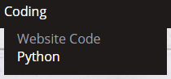
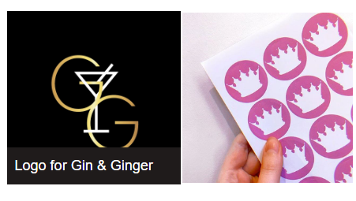
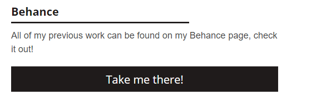
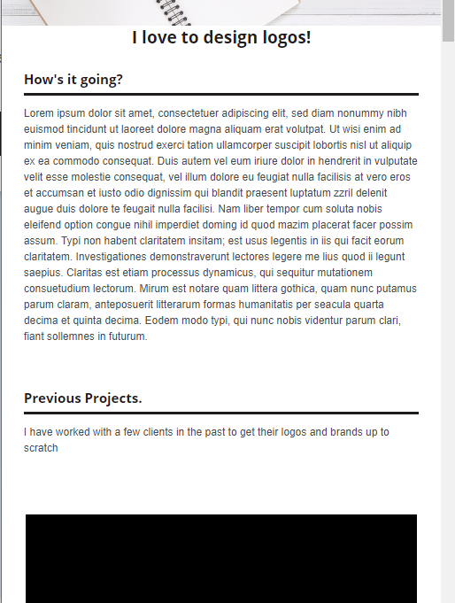
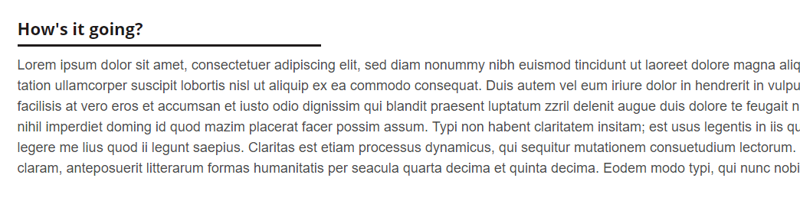
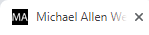
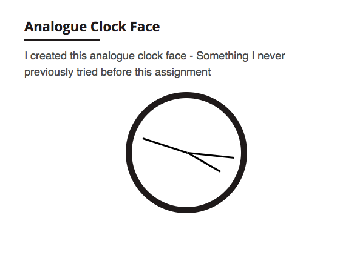
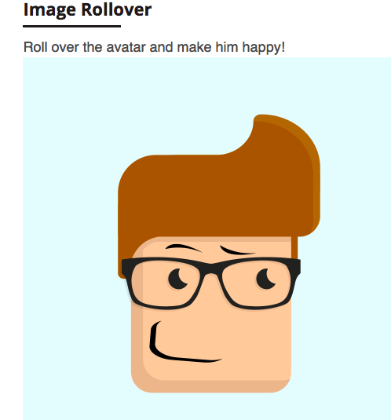
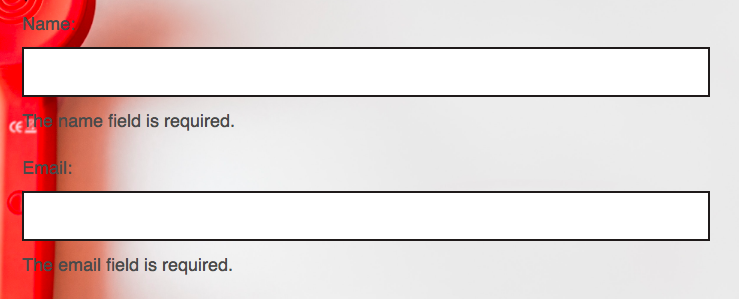
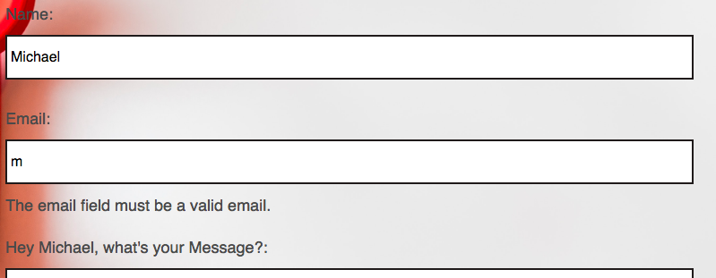

# Test Table

|Number|Test | Description | Test Method | Pass/Fail | Further Action Required
|------|-----|-------------|-------------|-----------|-------------------------
|1|Nav | Ensure all Nav links work | Click all links individually | Pass | None
|2| Nav | Links should change colour on hover | Hover all links | Pass | None
|3| Nav | "Design" and "Coding" should show a dropdown menu | Hover on design and coding | Pass | None 
|4| Images | Images should load quickly on the website | Test loading speed for both Mobile and Desktop | Pass | None 
|5| Images | Certain images should animate on hover | Hover over images | Pass | None
|6| Images | Text should appear over certain images on hover | Hover over images | Pass | None
|7| Images | Certain images should redirect to a different page | Click on images and check links | Pass | None 
|8| Buttons | Buttons should change colour on hover | Hover over buttons | Pass | None
|9| Buttons | Buttons should redirect to an internal/external site page | Click on buttons | Pass | None
|10| Responsive | Elements should stack on Mobile | Developer Tools |Pass | None
|11| Responsive | Images should resize on Mobile to be full width| Developer Tools | Pass | None
|12| Responsive | Font should resize on Mobile | Developer Tools | Pass | None
|13| Favicon | The Favicon should appear on every page | Google Chrome | Pass | None
|14| JavaScript | Analogue clock displays and updates on JavaScript page | Load JavaScript page |Pass | None
|15| JavaScript | Avatar image changes to happy on rollover | Rollover image |Pass | None
|16| Validation | Form should require name and email | Pass | Input erroneous data | None
|17| Validation | Form should require a valid email | Pass | Input erroneous data |None
|18| Name update | Form should display users name in realtime from the "name" input | Input data into name field |Pass | None

# Test Screenshots

|Test Number|Screenshot
|-----------|----------
|2, 3| 
|5, 6| 
|8| 
|10| 
|11| 
|12|  
|13| 
|14| 
|15| 
|16| 
|17, 18| 
